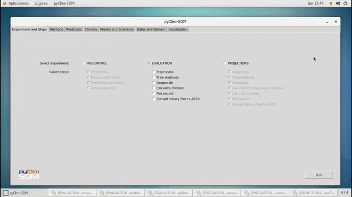

# pyClim-SDM: Statistical Downscaling for Climate Change Projections with a Graphical User Interface  

**Attention:** This repository has been migrated to https://gitlab.aemet.es/aemc/scenarios/pyClim-SDM

  

  

**Institution:** Spanish Meteorological Agency (AEMET)

**License:** GNU General Public License v3.0

**Citation:** Hernanz, A., Correa, C., García-Valero, J. A., Domínguez, M., Rodríguez-Guisado, E., & Rodríguez-Camino, E. (2023). pyClim-SDM: Service for generation of statistical downscaled climate change projections supporting national adaptation strategies. Climate Services. https://doi.org/10.1016/j.cliser.2023.100408
