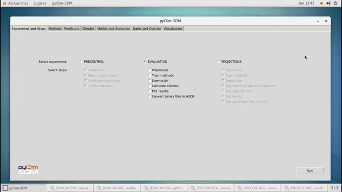

# pyClim-SDM: Statistical Downscaling for Climate Change Projections with a Graphical User Interface  
 
  

  

**Institution:** Spanish Meteorological Agency (AEMET)

**License:** GNU General Public License v3.0

**Citation:** Hernanz, A., Correa, C., García-Valero, J. A., Domínguez, M., Rodríguez-Guisado, E., & Rodríguez-Camino, E. (2023). pyClim-SDM: Service for generation of statistical downscaled climate change projections supporting national adaptation strategies. Climate Services. https://doi.org/10.1016/j.cliser.2023.100408
___

pyClim-SDM is a software for statistical downscaling of climate change projections for the following daily surface variables: mean, maximum and minimum temperature, precipitation, zonal and meridional wind components, relative and specific humidity, cloud cover, surface downwelling shortwave and longwave radiation, evaporation, potential evaporation, sea level pressure, surface pressure, total runoff and soil water content.
Additionally, it is prepared for downscaling any other user defined variable. pyClim-SDM incorporates the following utilities:
- evaluation of Global Climate Models (GCMs).
- downscaling of both reanalysis (for evaluation) and GCMs.
- bias correction of downscaled climate projections.
- post-processing: ETCCDI extreme climate indices (https://www.climdex.org/learn/indices/).
- visualization of downscaled projections and evaluation metrics.

